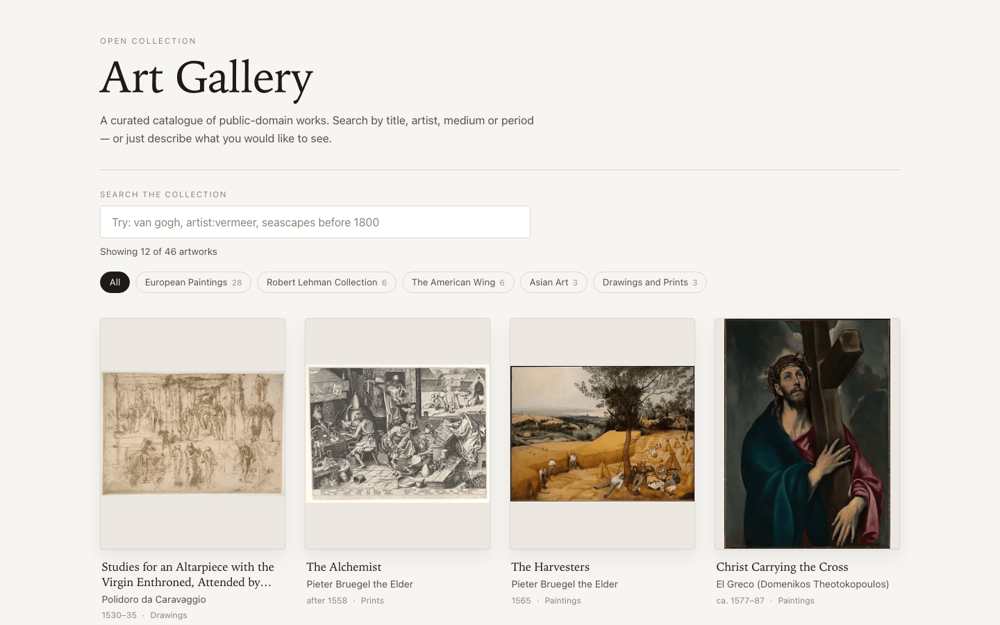
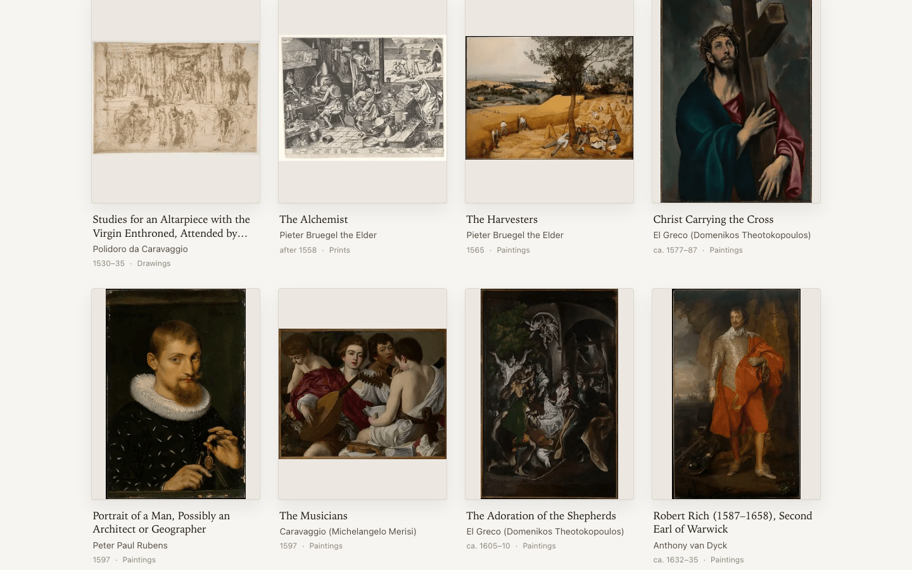
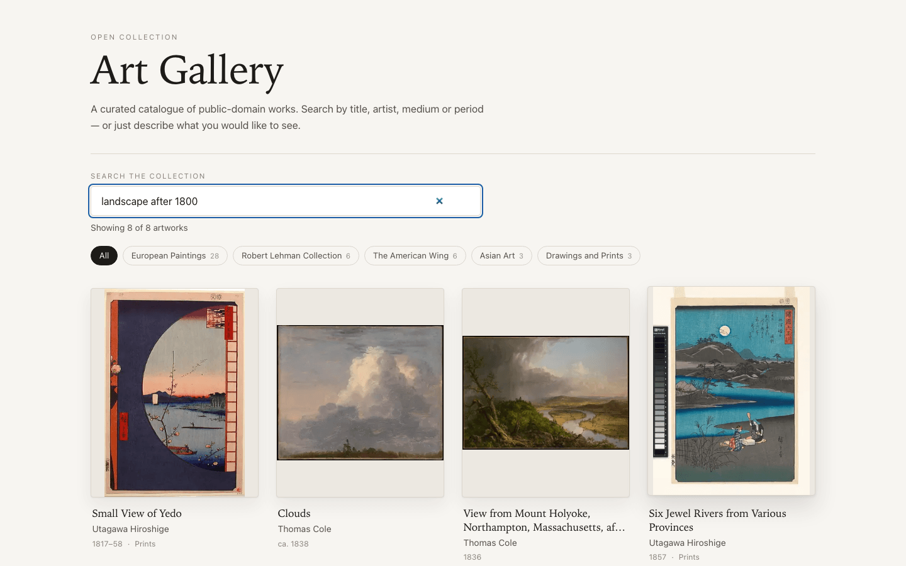
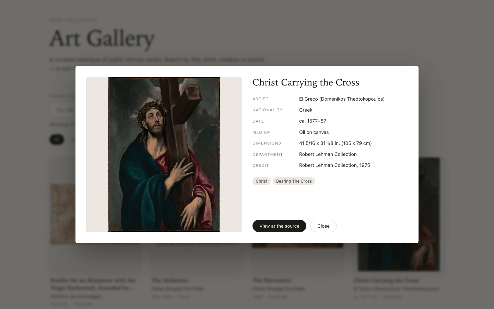
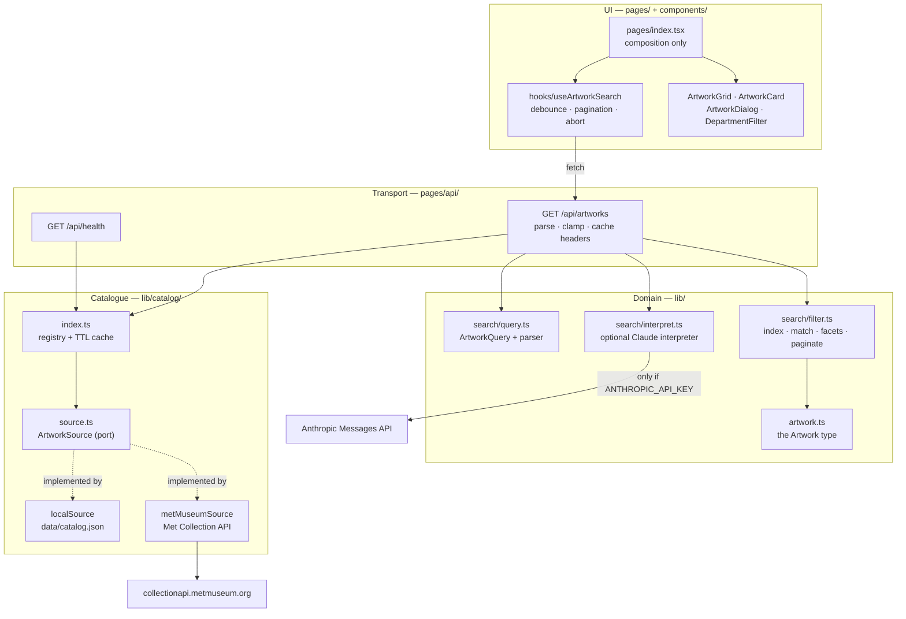
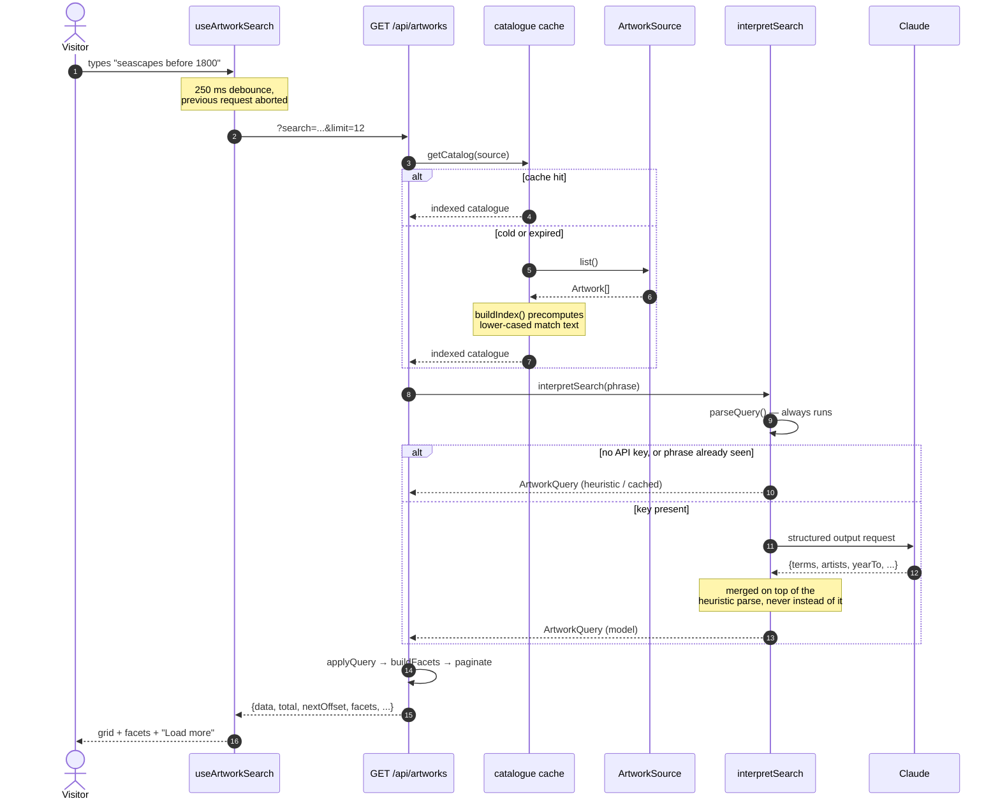

# Art Gallery

A small Next.js application for browsing a catalogue of public-domain artworks. It ships with
46 works from the Metropolitan Museum of Art's open-access collection, and can just as easily
read from the Met's live API instead — the catalogue is behind a one-method interface, and
everything above it is unaware of where the records came from.

Search understands both plain words and structured phrases (`artist:vermeer`, `landscape after
1800`, `"still life"`). If an Anthropic API key is present it also understands free-form
descriptions; if it is not, search still works exactly the same way, just without that layer.

## Screenshots

| Gallery                                                                                                    | Grid                                                              |
| ---------------------------------------------------------------------------------------------------------- | ----------------------------------------------------------------- |
|  |  |

| Structured search                                                                                     | Artwork detail                                                                                     |
| ----------------------------------------------------------------------------------------------------- | -------------------------------------------------------------------------------------------------- |
|  |  |

Captured with Playwright at 1440x900 against the Docker image on `http://localhost:8120`.

## Architecture

The shape is ports-and-adapters, kept deliberately small. `ArtworkSource` is the port; the
bundled catalogue and the live Met API are its two adapters. Dependencies point inward:
adapters know about the domain, the domain knows nothing about them.



## Request flow

One search, end to end. Every hop that can be skipped is skipped: typing is debounced,
in-flight requests are aborted, the catalogue is cached and indexed once, and a repeated
natural-language phrase never reaches the model twice.



## Quickstart

### Docker (one command, no manual steps)

```bash
docker compose up --build
```

The gallery is on <http://localhost:8120>. It is populated on first boot — the seed catalogue
is baked into the image, so there is nothing to import. The container reports readiness on `/api/health`, which is
also what the Compose healthcheck polls — `docker compose ps` shows `healthy` once the
catalogue has loaded:

```console
$ curl -s http://localhost:8120/api/health
{"status":"ok","source":"local","artworks":46,"aiSearch":"disabled"}
```

Tear it down with `docker compose down -v`.

### Without Docker

```bash
npm install
npm run dev          # http://localhost:3000
```

## Configuration

Every variable is optional; with none set the app runs against the bundled catalogue.

| Variable                 | Required | Default         | What it does                                                                                                                                                                |
| ------------------------ | -------- | --------------- | --------------------------------------------------------------------------------------------------------------------------------------------------------------------------- |
| `ARTWORK_SOURCE`         | no       | `local`         | Which `ArtworkSource` to read. `local` uses `data/catalog.json`; `met` fetches live from the Met Collection API. An unknown value logs a warning and falls back to `local`. |
| `CATALOG_CACHE_TTL_MS`   | no       | `600000`        | How long an indexed catalogue is reused before the source is asked again.                                                                                                   |
| `AI_SEARCH_CACHE_TTL_MS` | no       | `900000`        | How long a natural-language interpretation is reused.                                                                                                                       |
| `ANTHROPIC_API_KEY`      | no       | unset           | Enables natural-language search. Unset means the heuristic parser handles every query.                                                                                      |
| `ANTHROPIC_MODEL`        | no       | `claude-opus-5` | Overrides the model used for query interpretation.                                                                                                                          |
| `PORT`                   | no       | `3000`          | Port the Next.js server binds to inside the container.                                                                                                                      |

Copy `.env.example` to `.env` to set them for Compose. No key is ever read from anywhere but
the environment.

## Development

```bash
npm run dev            # dev server with fast refresh
npm run build          # production build (also type-checks)
npm start              # serve the production build
npm test               # Jest suite
npm run test:coverage  # suite + coverage report (thresholds enforced)
npm run lint           # ESLint (next/core-web-vitals + prettier)
npm run typecheck      # tsc --noEmit
npm run format         # Prettier
npm run seed           # regenerate data/catalog.json from the Met API
```

`npm run seed` re-queries the Met by artist, keeps only public-domain objects with a reachable
image, and rewrites `data/catalog.json`. It is the only script that talks to the network, and
nothing at runtime depends on it having been run.

No test makes a real API call. The Anthropic client is injected, the Met adapter takes a
`fetchImpl`, and the page tests drive a stub of `/api/artworks` that honours search, department,
limit and offset — so pagination and filtering are exercised end to end without a server.

## Project structure

```
components/              presentation only — no data fetching, no business rules
  ArtworkCard.tsx          one framed work; opens the detail dialog
  ArtworkDialog.tsx        modal with focus trap, Escape and focus restore
  ArtworkImage.tsx         next/image frame with skeleton and failure states
  ArtworkGrid.tsx          grid plus loading skeletons
  DepartmentFilter.tsx     facet chips
  SearchBar.tsx            search input and result line
  StateMessage.tsx         empty and error states
hooks/
  useArtworkSearch.ts      all client state: debounce, abort, pagination, retry
lib/
  artwork.ts               the Artwork domain type
  cache/ttlCache.ts        TTL + LRU cache with single-flight misses
  catalog/
    source.ts              the ArtworkSource port
    localSource.ts         adapter over the bundled catalogue
    metMuseumSource.ts     adapter over the Met Collection API
    index.ts               source registry + cached, indexed catalogue
  search/
    query.ts               ArtworkQuery, the heuristic parser, merging
    filter.ts              search index, matching, facets, pagination
    interpret.ts           optional Claude-backed query interpretation
pages/
  index.tsx                composition of the gallery
  api/artworks.ts          GET /api/artworks
  api/health.ts            GET /api/health
data/catalog.json          46 seeded public-domain works (CC0 metadata)
scripts/build-catalog.mjs  regenerates the seed from the Met API
docs/screenshots/          README screenshots
__tests__/                 Jest suites, fixtures and mocks
```

## Design notes

**One seam, chosen deliberately.** A gallery has exactly one interesting axis of change: where
the artwork comes from. `ArtworkSource` is a three-member interface, and adding a source means
writing an adapter and calling `registerSource`. Nothing else in the app knows a source exists —
the API route asks for a catalogue, not for the Met. The live `met` adapter is not decoration;
it is the proof that the seam holds, and it is what made the caching below necessary rather
than speculative.

**The bottlenecks are the ones a gallery actually has.**

- _Refetching on every keystroke._ Typing is debounced by 250 ms and the previous request is
  aborted, so a burst of typing costs one request rather than one per character.
- _Re-deriving match text per request._ The catalogue is indexed once per load: each artwork
  gets a single lower-cased haystack. Filtering is then substring tests over precomputed
  strings, with no per-request allocation. This is invisible at 46 records and load-bearing at
  the Met's 400,000.
- _Re-fetching upstream on every view._ `getCatalog` caches the indexed catalogue per source
  with a TTL, and `getOrCreate` collapses concurrent cold-start misses into a single upstream
  pass — without it, the `met` adapter would fire dozens of requests per visitor on a cold
  start.
- _Unbounded responses._ The API pages with `offset`/`limit`, clamps `limit` to 48, and returns
  `nextOffset` so the client never guesses. The UI appends pages rather than replacing them.
- _Oversized images._ Artwork is served through Next's image pipeline with explicit
  `deviceSizes`/`imageSizes` and lazy loading below the first row. A representative work drops
  from a 57 KB upstream JPEG to a 12 KB WebP at the 300 px the grid actually renders — and only
  the first row is fetched eagerly. `sharp` is an optional dependency for exactly this: with it
  the optimiser transcodes in ~1.4 s and emits WebP, without it Next falls back to a slower
  WASM encoder that only emits JPEG.
- _Paying the model on every request._ Interpretations are cached by query string, so a
  repeated phrase — from the same visitor or a different one — costs nothing.

**The AI layer is additive, not load-bearing.** `interpretSearch` always runs the heuristic
parser first. When a key is configured, Claude fills in the same `ArtworkQuery` shape against
the catalogue's real vocabulary (its departments, mediums and artists are in the system prompt,
behind a cache breakpoint) and the result is _merged on top of_ the parse — a bad
interpretation can add filters, never drop the visitor's literal words. Any failure, timeout or
malformed reply falls back to the heuristic path with a single warning. The UI marks a query
the model expanded with an "AI" badge so the behaviour is never mysterious.

**The UI is the product, so it got real attention.** Works sit contained on a mat rather than
cropped to fill a card, because cropping a painting is the wrong default for a gallery; the
fixed frame ratio also means zero layout shift as images stream in. There are distinct loading,
empty and failure states — including a per-image failure that degrades to a caption instead of
a broken icon. Cards are buttons, the dialog traps focus and restores it on close, and the
whole grid is reachable and operable from the keyboard. Light and dark palettes are both
defined, and reduced-motion is honoured.

**What was deliberately not built.** No database, no ORM, no queue, no state-management
library, no component framework. A 46-record read-only catalogue does not need them, and adding
them to a small app is a louder signal than leaving them out.

## Limitations

- The catalogue is read-only. There is no way to add, edit or curate works from the UI.
- Search is substring matching over precomputed text, not a ranked index. There is no relevance
  ordering, no stemming and no typo tolerance; results come back in catalogue order.
- Filtering scans the whole catalogue in memory. That is right for tens of thousands of records
  and wrong for millions — at that point the source adapter should push the query upstream
  rather than list everything.
- Facet counts are computed over the unfiltered catalogue, so they do not narrow as you search.
  That is intentional (chips stay stable) but it does mean a count can exceed the visible
  results.
- The `met` source fetches per object and is rate-limited upstream; it is a demonstration of
  the seam, not a production ingestion path.
- Natural-language search adds a round-trip to the Anthropic API on the first use of a given
  phrase. It is off unless a key is set.
- Images are hot-linked from the museum's CDN. With no outbound network the metadata still
  renders, but every frame shows its "Image unavailable" state.
- Next.js 12 with the Pages Router is kept as-is; nothing here depends on the App Router.

## Attribution

Artwork metadata and images come from [The Metropolitan Museum of Art Collection
API](https://metmuseum.github.io/). Open-access metadata is CC0; only objects the Met marks as
public domain are included.
