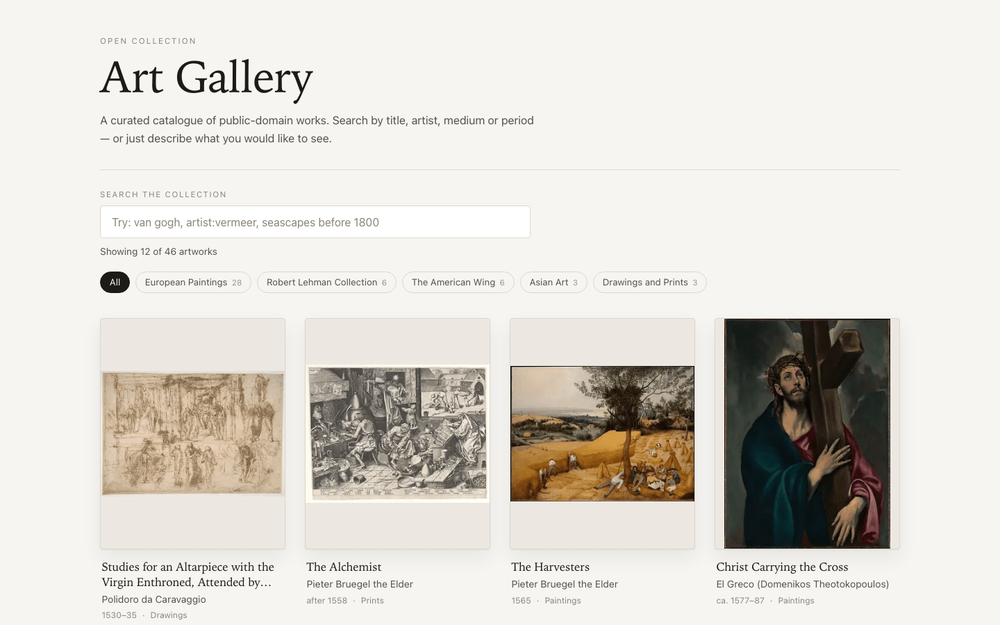
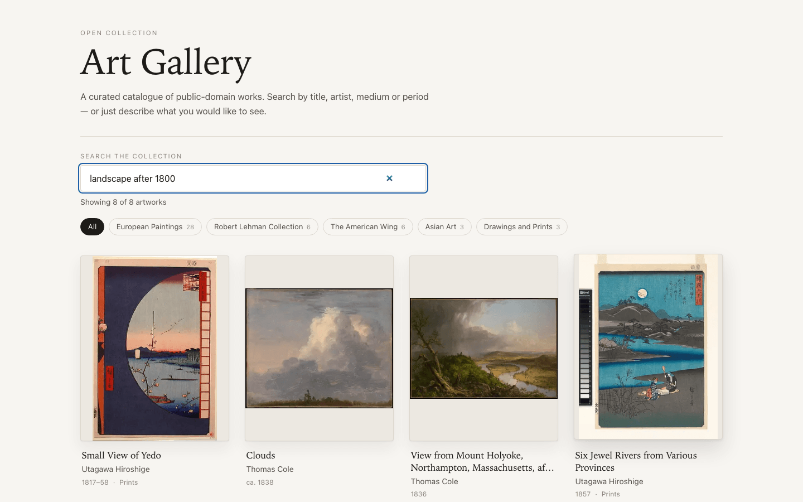
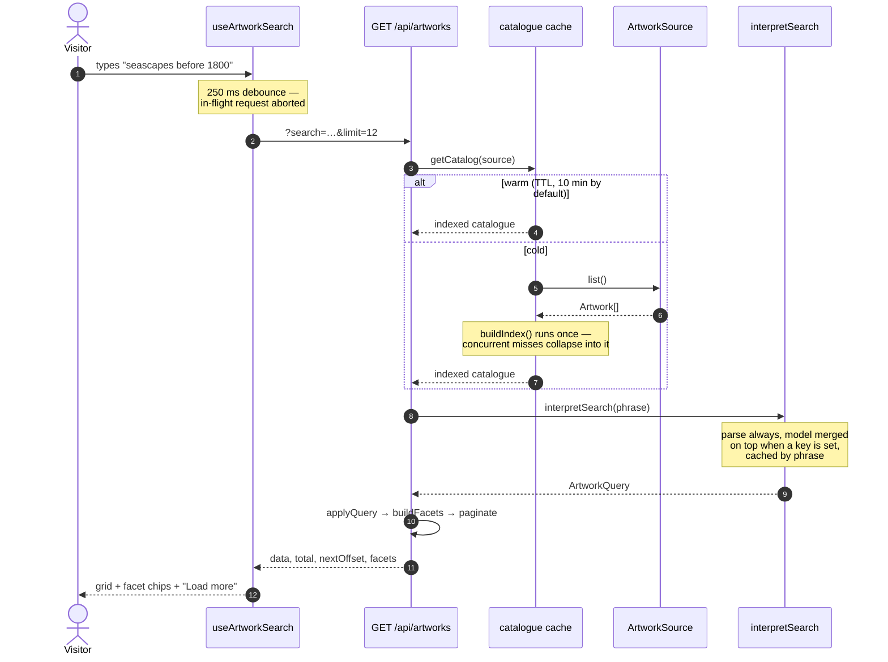
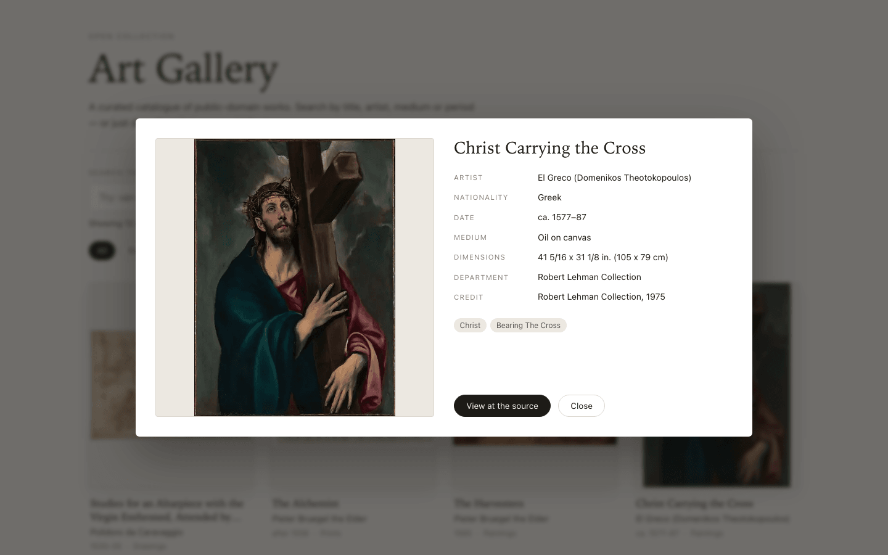
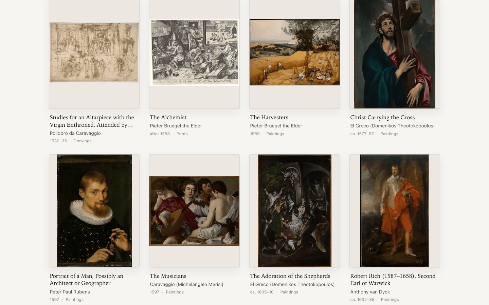

# Art Gallery

Browse 46 public-domain works from the Metropolitan Museum of Art. Search them by title,
artist, medium or period — or just describe what you would like to see. The catalogue sits
behind a one-method interface, so the same app reads the Met's live API instead when you
change one environment variable.



Next.js 12 (Pages Router), React 17, TypeScript. No database, no ORM, no state-management
library, no component framework — a read-only catalogue of this size does not need them.
112 tests, 99% statement coverage.

## What happens to what you type

Three layers, in order, and each one is allowed to fail without taking search down.

**The parser always runs.** `lib/search/query.ts` turns a raw string into an `ArtworkQuery`
with no network and no configuration. It understands field tokens (`artist:vermeer`,
`medium:oil`, `tag:landscape`, `department:"asian art"`), quoted phrases, and the date
phrasings people actually type: `before 1800`, `after 1850`, `1800-1900`, `19th century`,
`1880s`. Anything it does not recognise stays in the free-text terms instead of being
dropped, so a miss degrades to a substring search rather than an empty grid.



**Claude is layered on top, only if `ANTHROPIC_API_KEY` is set.** It fills in the same
`ArtworkQuery` shape for the half a parser cannot do — "moody seascapes painted before the
impressionists". The catalogue's real departments, mediums and artists go into the system
prompt behind a cache breakpoint, so the only variable half of the request is the phrase
itself. The model's answer is **merged on top of** the parse, field by field, never
substituted for it: a bad interpretation can add a filter, it can never lose your literal
words. Any failure, timeout or malformed reply falls back to the parse with one warning.
With no key, `createClaudeInterpreter` returns `null` and the feature is *absent* rather
than broken — nothing is disabled, nothing warns per request. The UI marks a
model-expanded query with an "AI" badge, and `?ai=off` forces the heuristic path.

**Matching is substring tests over a precomputed index.** `buildIndex` gives each work one
lower-cased haystack when the catalogue loads, so filtering allocates nothing per request.
Invisible at 46 records; the reason it is here at all is the live Met source, where the
catalogue is orders of magnitude bigger.

## One search, end to end


```mermaid
sequenceDiagram
    autonumber
    actor V as Visitor
    participant H as useArtworkSearch
    participant A as GET /api/artworks
    participant C as catalogue cache
    participant S as ArtworkSource
    participant I as interpretSearch

    V->>H: types "seascapes before 1800"
    Note over H: 250 ms debounce —<br/>in-flight request aborted
    H->>A: ?search=…&limit=12
    A->>C: getCatalog(source)
    alt warm (TTL, 10 min by default)
        C-->>A: indexed catalogue
    else cold
        C->>S: list()
        S-->>C: Artwork[]
        Note over C: buildIndex() runs once —<br/>concurrent misses collapse into it
        C-->>A: indexed catalogue
    end
    A->>I: interpretSearch(phrase)
    Note over I: parse always, model merged<br/>on top when a key is set,<br/>cached by phrase
    I-->>A: ArtworkQuery
    A->>A: applyQuery → buildFacets → paginate
    A-->>H: data, total, nextOffset, facets
    H-->>V: grid + facet chips + "Load more"
```

Every hop that can be skipped is skipped: typing is debounced by 250 ms and the previous
request aborted, the indexed catalogue is cached per source, and a repeated phrase never
reaches the model twice. The API clamps `limit` to 48 and returns `nextOffset`, so the
client never guesses how to page; the UI appends pages rather than replacing them.

## Changing where the artwork comes from

A gallery has one interesting axis of change: the source. `ArtworkSource` is the whole seam
— `name`, `attribution`, `list()` — and `lib/catalog/index.ts` holds a registry keyed by
`ARTWORK_SOURCE`. Adding a museum, a CMS or a customer's own collection means writing
`list()` and calling `registerSource`. Nothing above it knows a source exists: the API route
asks for a catalogue, not for the Met.

Two adapters ship. `localSource` reads `data/catalog.json`; `metMuseumSource` queries the
live Met Collection API, keeps only public-domain objects with a reachable image, and takes
a `fetchImpl` so it is testable without the network. The second adapter is not decoration —
it is the proof the seam holds, and it is what made the caching honest rather than
speculative. `ARTWORK_SOURCE=met` boots healthy against the live API; it yielded 6 works on
that run, because the Met's search endpoint is genuinely erratic.

An unknown `ARTWORK_SOURCE` logs one warning and falls back to `local` rather than 500ing.

## Running it

```bash
docker compose up --build     # http://localhost:8120
```

The seed catalogue is baked into the image, so first boot is a populated gallery with no
import step. Compose polls `/api/health`, which is only `ok` once the configured source has
produced a non-empty catalogue:

```console
$ curl -s http://localhost:8120/api/health
{"status":"ok","source":"local","artworks":46,"aiSearch":"disabled"}
```

Tear it down with `docker compose down -v`. Without Docker:

```bash
npm install
npm run dev     # http://localhost:3000
```

Every environment variable is optional; with none set the app runs against the bundled
catalogue and the parser handles every query.

| Variable                 | Default         | Effect                                                              |
| ------------------------ | --------------- | ------------------------------------------------------------------- |
| `ARTWORK_SOURCE`         | `local`         | `local` reads `data/catalog.json`; `met` fetches from the Met API.  |
| `CATALOG_CACHE_TTL_MS`   | `600000`        | How long an indexed catalogue is reused before the source is asked. |
| `AI_SEARCH_CACHE_TTL_MS` | `900000`        | How long an interpretation is reused.                               |
| `ANTHROPIC_API_KEY`      | unset           | Enables natural-language search. Read from the environment only.     |
| `ANTHROPIC_MODEL`        | `claude-opus-5` | Model used for query interpretation.                                 |
| `PORT`                   | `3000`          | Port the server binds to inside the container.                       |

Copy `.env.example` to `.env` to set them for Compose.

## The screen is the product



Works sit contained on a mat rather than cropped to fill a card, because cropping a painting
is the wrong default for a gallery; the fixed frame ratio also means zero layout shift as
images stream in. Cards are buttons, the dialog takes focus on open, traps Tab in both
directions, closes on Escape or backdrop, and returns focus to the card that opened it.
Loading, empty and failure states are all distinct, including a per-image failure that
degrades to a caption instead of a broken icon. Light and dark palettes are both defined and
`prefers-reduced-motion` is honoured.



Images come through Next's pipeline with tuned `deviceSizes`/`imageSizes`, eager for the
first four cards and lazy below. A representative work drops from a **57 KB upstream JPEG to
a 12 KB WebP** at the 300 px the grid actually renders. `sharp` is an optional dependency for
exactly this: with it the optimiser transcodes in ~1.4 s and emits WebP; without it Next 12
falls back to a bundled WASM encoder that took ~8.8 s and emitted a 122 KB JPEG.

## Two things that were broken here first

The production build did not work at all. `tsconfig.json` set no `types`, so TypeScript
pulled in every package under `node_modules/@types`, including `@types/babel__traverse` —
whose `infer N extends number` is syntax TypeScript 4.5.5 cannot parse. `skipLibCheck` does
not suppress a *parse* error, so `tsc --noEmit` and `next build` both failed. Restricting
`types` to `["node", "react", "jest"]` fixed it.

And search silently returned nothing for any capitalised term: the filter compared a
lower-cased haystack against the caller's raw input, so `'Mona'` returned `[]` while
`'mona'` returned one work. It only appeared to work because the single call site happened
to pre-normalise first. Normalisation now happens inside the query layer.

## Tests

`npm test` — 13 suites, 112 tests, no network calls anywhere. `npm run test:coverage`
enforces the thresholds in `jest.config.js` (90/85/90/90) and currently reports 99.2%
statements, 92.1% branches. The Anthropic client is injected, the Met adapter takes
a `fetchImpl`, and the page tests drive a stub of `/api/artworks` that honours search,
department, limit and offset — so pagination and filtering are exercised end to end without
a server. Also available: `npm run lint`, `npm run typecheck`, `npm run format`.

`npm run seed` regenerates `data/catalog.json` from the Met API, verifying public-domain
status and image reachability per object. It is the only script that touches the network,
and nothing at runtime depends on it having been run.

## What it does not do

- **No writing.** The catalogue is read-only; there is no curation UI.
- **No ranking.** Search is substring matching, not a scored index — no relevance order, no
  stemming, no typo tolerance. Results come back in catalogue order.
- **No pushdown.** Filtering scans the catalogue in memory. Right for tens of thousands of
  records, wrong for millions; past that the adapter should push the query upstream.
- **Facet counts do not narrow.** They are computed over the unfiltered catalogue so the
  chips stay stable while you type, which means a count can exceed the visible results.
- **`met` is a demonstration, not an ingestion path.** It fetches per object and is
  rate-limited upstream.
- **Images are hot-linked** from `images.metmuseum.org`. With no outbound network the
  metadata still renders, but every frame shows its "Image unavailable" state.
- Next 12 with the Pages Router is kept as-is; nothing here depends on the App Router.

## Attribution

Metadata and images come from [The Metropolitan Museum of Art Collection
API](https://metmuseum.github.io/). Open-access metadata is CC0, and only objects the Met
marks as public domain are included. Screenshots were captured with Playwright at 1440x900
against the container on `http://localhost:8120`, waiting for every image to finish loading
so no frame is a skeleton.
